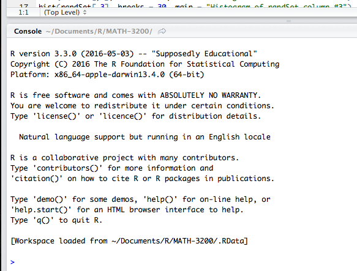

# Preparation for scRNA-seq data analysis course

We will analyse single cell RNA-sequencing data using the R-package Seurat. For a smooth start of the seminar, please download the dataset, R and RStudio in advance and install R and RStudio (see instructions below).

You can additionally download and set up the R-packages we are going to be using to be fully prepared for day 1 of class. You can find instructions for all steps below. If everything goes well, you should

- have successfully installed Seurat, ggplot2 and reshape2
- be able to load the required packages into R without running into any errors. (Unfortunately, you won't see a message indicating successful loading. Instead you have to look for the absence of an error message.)

## Download all three files of the single cell data set:
You may or may not be asked to enter credentials, if asked use those given below and not your Charité / BIH credentials.

Barcodes: https://filetransfer.mdc-berlin.de/?u=YJkxpQFn&p=3gX7RMKc&path=/barcodes.tsv.gz
username: YJkxpQFn  password: 3gX7RMKc

Features: https://filetransfer.mdc-berlin.de/?u=24KEPJ44&p=uCnRzWzr&path=/features.tsv.gz
username: 24KEPJ44   password: uCnRzWzr

Matrix: https://filetransfer.mdc-berlin.de/?u=rbmBpHkj&p=MdMjudWZ&path=/matrix.mtx.gz
username: rbmBpHkj   password: MdMjudWZ

You should now have the following files: barcodes.tsv.gz, features.tsv.gz and matrix.mtx.gz.
Mac-users: don't click the files to open them, as this automatically unzips them (which then causes problems when loading them into Seurat).

## Download R and RStudio if you don't have them installed already:

If you donʼt have R on your computer -> [Download R (preferably version 4)](https://cran.r-project.org/)

If you donʼt have RStudio on your computer -> [Download RStudio](https://www.rstudio.com/products/rstudio/download/)

Install first R and then RStudio, following the instructions on the respective websites.


## If you have R and RStudio installed already:
Check your R version by opening RStudio




## If you still have R version 3, follow these instructions:

*Instructions for R version 4 can be found in the next section.*

You could think about updating your R version at this stage. Note that this will deprecate all packages that you have previously installed, meaning you need to re-install them. Furthermore, packages may be a bit different between versions or not available for R version 4 – if you have scripts based on R version 3 and you want to keep on using them, it may be better to stick to R version 3 for now.

Load Seurat version 3 - In your console in RStudio, execute the following commands:

```
install.packages("remotes")
remotes::install_version("Seurat", version = "3.2.3")
```

Install a couple of other packages that you will need by executing the commands below. This includes the umap-learn functionality, which requires python. If you don't have python on your computer, RStudio will likely ask you whether you want to install a minimal python environment via miniconda. If you get asked this question, enter y and press return.

```
install.packages('ggplot2')
reticulate::py_install(packages = 'umap-learn')
install.packages('reshape2')
```

You can load the installed packages with the "library()" command to see whether everything is working properly:

```
library(Seurat)
library(reshape2)
library(ggplot2)
```

If (almost) nothing happens, when executing these commands, everything is fine! You've successfully prepared for the upcoming course.

## If you have R version 4, follow these instructions:

```
install.packages('Seurat')
install.packages('reshape2')
install.packages('ggplot2')
```

If you see the warning message below, enter y and press return:

```
package which is only available in source form, and may need compilation
of C/C++/Fortran: 'Seurat'
Do you want to attempt to install these from sources?
y/n:
```

You can load the installed packages with the "library()" command to see whether everything is working properly:

```
library(Seurat)
library(reshape2)
library(ggplot2)
```

If (almost) nothing happens, when executing these commands, everything is fine! You've successfully prepared for the upcoming course.
